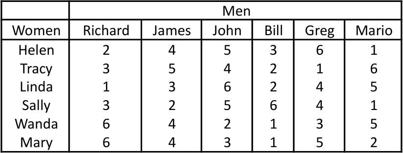
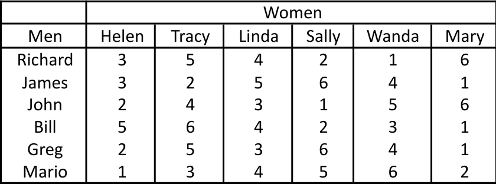

<div align="center">


</div>


# Trabajo Parcial

## **1. Introduccion**
Los problemas de satisfacción de restricciones (CSP) son problemas matemáticos definidos por un conjunto de variables, cada una con un dominio de valores, y un conjunto de restricciones que deben cumplirse. En un CSP se asignan valores a las variables de manera que satisfagan todas las restricciones impuestas. Estos problemas son comunes en inteligencia artificial e investigación de operaciones, pues permiten modelar diversas situaciones reales (por ejemplo, asignación de recursos, planificación y puzles) en términos de variables y restricciones. En general, los CSP pueden ser complejos (a menudo de tipo NP) y suelen requerir la combinación de búsqueda exhaustiva con propagación de restricciones para encontrar soluciones en un tiempo razonable.

En el presente trabajo se aborda la resolución de uno de los problemas incluidos en un conjunto de problemas de CSP. Para ello se construyó un modelo del problema usando Python y la librería OR-Tools de Google, empleando específicamente el solver CP-SAT. En el modelo se definieron variables y dominios apropiados, junto con restricciones que representan las condiciones del problema. Una vez definido el modelo con sus constraints, se ejecuta el solver para encontrar soluciones que satisfacen todas las restricciones. Las etapas de modelado del CSP, las restricciones aplicadas y la solución obtenida se detallan en las secciones siguientes del trabajo.

## **2. Integrantes**

  <table border="1px" align="center">
    <thead>
        <tr>
            <th>Nombre</th>
            <th>Código</th>
        </tr>
    </thead>
    <tbody>
        <tr>
            <td>Antonio Francisco Datto Aponte</td>
            <td>u202017033</td>
        </tr>
        <tr>
            <td>Edison Jean Franco Coaguila Fuentes</td>
            <td>u202213102</td>
        </tr>
        <tr>
            <td>Luis Enrique Zegarra Garcia</td>
            <td>u202123273</td>
        </tr>
        <tr>
            <td>Joe Maicol Turpo Queque</td>
            <td>u202124254</td>
        </tr>
    </tbody>
</table>


## **3. Problema elegido**

El problema abordado en este trabajo es el Problema del Matrimonio Estable (Stable Marriage Problem). Este problema es un ejemplo clásico de un Problema de Satisfacción de Restricciones (CSP) que busca encontrar un emparejamiento entre dos grupos de igual tamaño que satisfaga condiciones específicas de estabilidad.

El escenario base involucra a un grupo de 6 hombres y un grupo de 6 mujeres

#### Preferencias
Cada hombre ha clasificado a las 6 mujeres en orden de preferencia, y de manera análoga, cada mujer ha clasificado a los 6 hombres. Las preferencias se almacenan en matrices numéricas donde un número menor indica una mayor preferencia.




#### Matrimonio
Un matrimonio se define como un conjunto de 6 parejas tal que cada hombre se casa exactamente con una mujer, y cada mujer se casa exactamente con un hombre.

#### Estabilidad
Un emparejamiento es inestable si existen dos parejas (m, w) y (m0, w0) tal que:

- m prefiere a w0 por encima de su pareja actual (w) , y

- w0 prefiere a m por encima de su pareja actual (m0).

Si no existe tal par, el emparejamiento es estable.

#### Objetivo del Proyecto

El objetivo principal es modelar este problema como un CSP y resolverlo utilizando el solver CP-SAT de OR-Tools para encontrar un emparejamiento estable.

#### Restriccion adicional
Adicionalmente, se impone una restricción específica que el modelo debe verificar:
- Se debe confirmar si existe un matrimonio estable tal que cada mujer esté casada a lo sumo con el cuarto hombre de su preferencia. Esto significa que, en la matriz de preferencias de las mujeres (tablero_w), el rank asignado al hombre emparejado debe ser 1, 2, 3 o 4, ya que las clasificaciones 5 y 6 (que son mayores a 4) indican una menor preferencia

## **4. Solucion**
### **4.1 Breve explicacion de la solucion**

El problema se modela utilizando el solver de OrTools con el objetivo de encontrar un emparejamiento entre 6 hombres y 6 mujeres que sea estable, es decir, donde no existan dos parejas que prefieran estar juntas antes que con sus parejas actuales. Además, se impone la restricción adicional de que cada mujer debe estar emparejada con un hombre que se encuentre como máximo en su 4ta preferencia. El problema se modela usando una matriz de 6x6 donde *matriz[i][j]* indica si el hombre *i* esta emparejado con la mujer *j*. Finalmente, el solver buscará todas las soluciones posibles que cumplan estas condiciones.

### **4.2 Variables**

Se definieron los siguientes elementos en la solución:

- Matrices de preferencias:

    - tablero_m: Matriz numérica que almacena las preferencias de los hombres sobre las mujeres (donde un número menor indica mayor preferencia).

    - tablero_w: Matriz numérica que almacena las preferencias de las mujeres sobre los hombres (misma convención).

- Modelo CSP:

    - model: Instancia de cp_model.CpModel() que contiene la definición del problema, incluyendo variables y restricciones.

    - Variables de decisión:

        - parejas: Matriz booleana de 6x6, donde parejas[m][w] es una variable binaria que indica si el hombre m está emparejado con la mujer w (True) o no (False). Estas son las variables principales que el solver debe determinar.

- Solver:

    - solver: Instancia de CpSolver() utilizada para resolver el modelo y encontrar las soluciones factibles.

### **4.3 Reestricciones**

- Definimos las restricciones en nuestro codigo agregandolas al modelo.

#### Las personas deben pertenecer a solo una pareja.

```python
for m in range(6):
    model.Add(sum(parejas[m][w] for w in range(6)) == 1)
for w in range(6):
    model.Add(sum(parejas[m][w] for m in range(6)) == 1)
```

#### La pareja de cada persona tiene que estar dentro de las 4 primeras de su preferencia.

```python
minRank = 4
for w in range(6):
    for m in range(6):
        if tablero_w[w][m] > minRank:
            model.Add(parejas[m][w] == 0) 
```

#### No puede haber 2 parejas (w, m) y (w0, m0) tal que m tenga mas preferencia por w0 que por w y que w0 tenga mas preferencia por m que por m0

```python
for m in range(6):
    for w in range(6):
        for m0 in range(6):
            for w0 in range(6):
                if tablero_m[m][w0] < tablero_m[m][w] and tablero_w[w0][m] < tablero_w[w0][m0]:
                    model.Add(parejas[m][w] + parejas[m0][w0] <= 1)
```

## **4.4 Resultados**

- Mostramos los resultados usando la clase SolutionPrinter.

```
Solución 1:
  Hombre 1  —  Mujer 4   (rank hombre: 2, rank mujer: 3)
  Hombre 2  —  Mujer 5   (rank hombre: 4, rank mujer: 4)
  Hombre 3  —  Mujer 2   (rank hombre: 4, rank mujer: 4)
  Hombre 4  —  Mujer 6   (rank hombre: 1, rank mujer: 1)
  Hombre 5  —  Mujer 3   (rank hombre: 3, rank mujer: 4)
  Hombre 6  —  Mujer 1   (rank hombre: 1, rank mujer: 1)

Solución 2:
  Hombre 1  —  Mujer 4   (rank hombre: 2, rank mujer: 3)
  Hombre 2  —  Mujer 3   (rank hombre: 5, rank mujer: 3)
  Hombre 3  —  Mujer 5   (rank hombre: 5, rank mujer: 2)
  Hombre 4  —  Mujer 6   (rank hombre: 1, rank mujer: 1)
  Hombre 5  —  Mujer 2   (rank hombre: 5, rank mujer: 1)
  Hombre 6  —  Mujer 1   (rank hombre: 1, rank mujer: 1)

Solución 3:
  Hombre 1  —  Mujer 4   (rank hombre: 2, rank mujer: 3)
  Hombre 2  —  Mujer 3   (rank hombre: 5, rank mujer: 3)
  Hombre 3  —  Mujer 2   (rank hombre: 4, rank mujer: 4)
  Hombre 4  —  Mujer 6   (rank hombre: 1, rank mujer: 1)
  Hombre 5  —  Mujer 5   (rank hombre: 4, rank mujer: 3)
  Hombre 6  —  Mujer 1   (rank hombre: 1, rank mujer: 1)

Solución 4:
  Hombre 1  —  Mujer 3   (rank hombre: 4, rank mujer: 1)
  Hombre 2  —  Mujer 4   (rank hombre: 6, rank mujer: 2)
  Hombre 3  —  Mujer 2   (rank hombre: 4, rank mujer: 4)
  Hombre 4  —  Mujer 6   (rank hombre: 1, rank mujer: 1)
  Hombre 5  —  Mujer 5   (rank hombre: 4, rank mujer: 3)
  Hombre 6  —  Mujer 1   (rank hombre: 1, rank mujer: 1)

Solución 5:
  Hombre 1  —  Mujer 3   (rank hombre: 4, rank mujer: 1)
  Hombre 2  —  Mujer 4   (rank hombre: 6, rank mujer: 2)
  Hombre 3  —  Mujer 5   (rank hombre: 5, rank mujer: 2)
  Hombre 4  —  Mujer 6   (rank hombre: 1, rank mujer: 1)
  Hombre 5  —  Mujer 2   (rank hombre: 5, rank mujer: 1)
  Hombre 6  —  Mujer 1   (rank hombre: 1, rank mujer: 1)

Total soluciones encontradas: 5
```

- Este problema tiene 5 combinaciones que satisfacen las restricciones. 

## **4.5 Conclusiones**